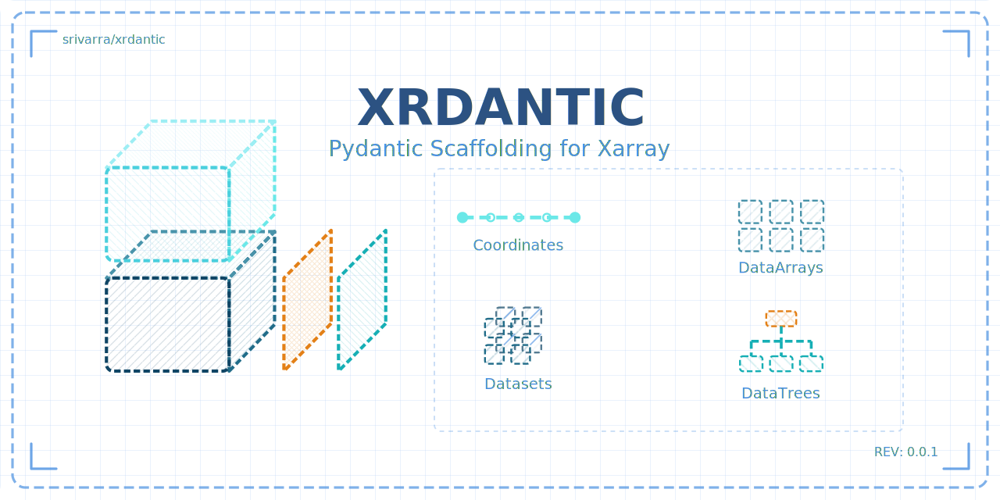

# xrdantic

<div align="center">

|               |                                                                                                                                                                                                              |
| :-----------: | :----------------------------------------------------------------------------------------------------------------------------------------------------------------------------------------------------------: |
|  **Status**   | [![Build][badge-build]][link-build] [![Tests][badge-test]][link-test] [![Documentation][badge-docs]][link-docs] [![codecov][badge-codecov]][link-codecov] [![pre-commit][badge-pre-commit]][link-pre-commit] |
|   **Meta**    |         [![Hatch project][badge-hatch]][link-hatch] [![Ruff][badge-ruff]][link-ruff] [![uv][badge-uv]][link-uv] [![License][badge-license]][link-license] [![gitmoji][badge-gitmoji]][link-gitmoji]          |
|  **Package**  |                                                                 [![PyPI][badge-pypi]][link-pypi] [![PyPI][badge-python-versions]][link-pypi]                                                                 |
| **Built With** |                                           [![Pydantic v2][badge-pydantic]][link-pydantic] [![Xarray][badge-xarray]][link-xarray]                                           |
|               |                                                                                                                                                                                                              |

</div>

[badge-build]: https://github.com/srivarra/xrdantic/actions/workflows/build.yaml/badge.svg
[badge-test]: https://github.com/srivarra/xrdantic/actions/workflows/test.yaml/badge.svg
[badge-docs]: https://img.shields.io/readthedocs/xrdantic?logo=readthedocs
[badge-codecov]: https://codecov.io/gh/srivarra/xrdantic/graph/badge.svg?token=LLUPQHDCK3
[badge-ruff]: https://img.shields.io/endpoint?url=https://raw.githubusercontent.com/astral-sh/ruff/main/assets/badge/v2.json
[badge-uv]: https://img.shields.io/endpoint?url=https://raw.githubusercontent.com/astral-sh/uv/main/assets/badge/v0.json
[badge-license]: https://img.shields.io/badge/License-MIT-yellow.svg
[badge-hatch]: https://img.shields.io/badge/%F0%9F%A5%9A-Hatch-4051b5.svg
[badge-pypi]: https://img.shields.io/pypi/v/xrdantic.svg?logo=pypi&label=PyPI&logoColor=gold
[badge-python-versions]: https://img.shields.io/pypi/pyversions/xrdantic.svg?logo=python&label=Python&logoColor=gold
[badge-pre-commit]: https://results.pre-commit.ci/badge/github/srivarra/xrdantic/main.svg
[badge-gitmoji]: https://img.shields.io/badge/gitmoji-😜😍-FFDD67.svg
[badge-pydantic]: https://img.shields.io/endpoint?url=https://raw.githubusercontent.com/pydantic/pydantic/main/docs/badge/v2.json
[badge-xarray]: https://img.shields.io/endpoint?url=https://gist.githubusercontent.com/ianhi/13d9737b1b6cded140de5adde9806944/raw/14a0347146a83762f4159ec68b0a50b454285ba5/gistfile1.json


Pydantic Scaffolding for Xarray

## Getting started

Please refer to the [documentation][],
in particular, the [API documentation][].

## Installation

You need to have Python 3.10 or newer installed on your system.
If you don't have Python installed, we recommend installing [uv][].

There are several alternative options to install xrdantic:

<!--
1) Install the latest release of `xrdantic` from [PyPI][]:

```bash
pip install xrdantic
```
-->

1. Install the latest development version:

```bash
pip install git+https://github.com/srivarra/xrdantic.git@main
```

## Release notes

See the [changelog][].

## Contact

For questions and help requests, you can reach out in the [discussion][link-discussions].
If you found a bug, please use the [issue tracker][link-issue-tracker].

## Citation

> t.b.a

[issue-tracker]: https://github.com/srivarra/xrdantic/issues
[changelog]: https://xrdantic.readthedocs.io/en/latest/changelog.html
[link-docs]: https://xrdantic.readthedocs.io
[link-api]: https://xrdantic.readthedocs.io/en/latest/api.html
[link-tutorial]: https://xrdantic.readthedocs.io/en/latest/notebooks/all_of_xrdantic.html
[link-pypi]: https://pypi.org/project/xrdantic
[link-codecov]: https://codecov.io/gh/srivarra/xrdantic
[link-test]: https://github.com/srivarra/xrdantic/actions/workflows/test.yml
[link-build]: https://github.com/srivarra/xrdantic/actions/workflows/build.yaml
[link-ruff]: https://github.com/astral-sh/ruff
[link-uv]: https://github.com/astral-sh/uv
[link-license]: https://opensource.org/licenses/MIT
[link-hatch]: https://github.com/pypa/hatch
[link-discussions]: https://github.com/srivarra/xrdantic/discussions
[link-pre-commit]: https://results.pre-commit.ci/latest/github/srivarra/xrdantic/main
[link-gitmoji]: https://gitmoji.dev/
[link-pydantic]: https://pydantic.dev
[link-xarray]: https://xarray.pydata.org/
